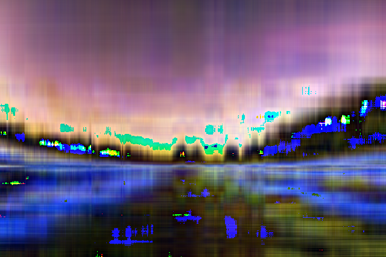
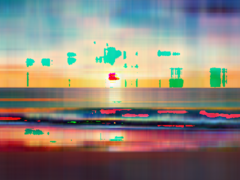

# Задача 3. Сингулярное разложение и сжатие изображений

Были использованы три различных способа получения сингулярного разложения матрицы для последующего сжатия изображений:

1. Реализация SVD из numpy.
2. Наивный численный метод, т.н. "Power method", описанный в [статье](https://www.jeremykun.com/2016/05/16/singular-value-decomposition-part-2-theorem-proof-algorithm/).
3. Численный метод, использующий преобразование Хаусхолдера, реализация взята из книги "Numerical Recipes in C", W. H. Press, S. A. Teulkolsky, W. T. Vetterling, B. P. Flannery.

Промежуточное представление заключается в сохранении сингулярных разложений для трёх цветовых каналов, с помощью numpy.

В ходе эксперимента выяснилось, что использование преобразования Хаусхолдера значительно ускорило процесс разложения по сравнению с Power method, однако на качество восстановленного изображения это не повлияло.

# Результаты сжатия (N=4):

> numpy:
> 
>> 480-360-sample.bmp: **0.2831961196899414**
> 
>>640-426-sample.bmp: **0.4301403216540233**

    
    

    
    

> Power method:
>
>> 480-360-sample.bmp: **105.17054432534667**
> 
>> 640-426-sample.bmp: **443.5307932171784**

    
    

    
    

> Householder method:
> 
>> 480-360-sample.bmp:  **6.421340213414454**
> 
>> 640-426-sample.bmp: **12.573240589511443**

    
    

    
    

